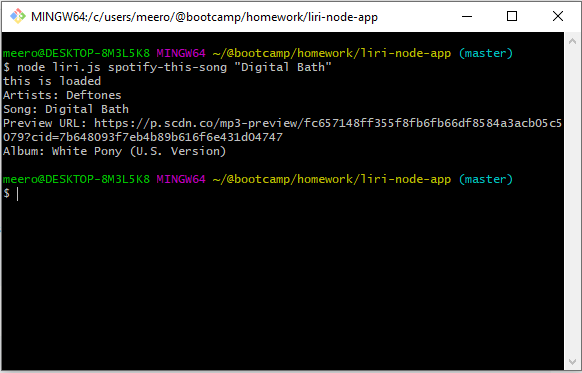
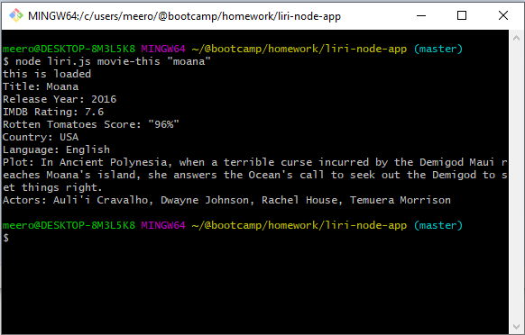

# liri-node-app

LIRI Bot will take in your commands for looking up concerts, songs, and movies and return information about that query. Want to see when your favorite band is in town? Ask LIRI!

## How to use
Run liri.js using node followed by a command and then a parameter.

To check concert information, type:
`node liri concert-this "Deftones"

For song information:
`node liri spotify-this-song "Digital Bath"

For movie information:
`node liri movie-this "Moana"

To read a random command from random.txt:
`node liri do-what-it-says

## Reading random command
The random.txt file contains a command and a parameter per line, formatted [command],[parameter].
Each command needs to be on its own line.
The application will read in a random line and carry out the command.

## Technologies
LIRI uses Axios, OMDb (web API), Node Spotify API, and dotenv.

-- Meero Harootunian, Developer